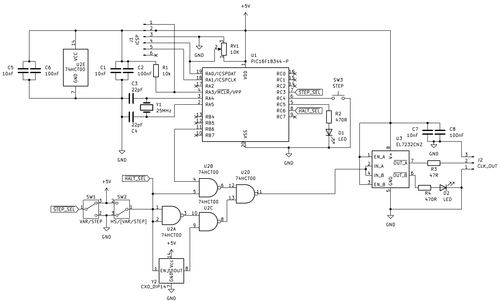

# PICclock Hardware

## Overview

**Architecture:**
```
                          ACTIVE CLOCK OUTPUT
                                  ^
                                  |
                          +-------+-------+
                          |U3: EL7232CNZ  |
                          | Line Driver   |
                          +-------+-------+
                                  |
                          +-------+-------+
                          |U2: 74HC00     |
                          | (VAR/HS MUX)  |
                          +---+-------+---+
                              |       |
                +-------------+       +-------------+
                |                                   |
        VARIABLE CLOCK                        HIGH-SPEED
        (PIC RB6 NCO output)                  OSCILLATOR
                |                                (Y2)
          +-----+-----+
          |   PIC     |
          |   U1      |
          +-----+-----+
           |  |  |  |  |
       [POT][BTN][SW1][SW2]
```



**Clock Modes:**
- **Variable**: Hybrid NCO/software clock from PIC (1 Hz - 1 MHz), 50% duty cycle
- **Step**: Single pulse per button press (handled by PIC, debounced in software)
- **High-Speed**: External oscillator bypass

**Frequency Control:** PIC reads potentiometer via ADC. Hardware NCO generates clock for 12 Hz - 1 MHz; software timing handles 1 Hz - 11 Hz. Frequency accuracy inherits PIC crystal stability (typically ±50 ppm).

**Output Driver:** EL7232CNZ line driver buffers clock output.

**Variable Frequency Range:** 1 Hz to 1 MHz (hybrid NCO/software, 50% duty cycle)

---

## Components

### ICs

| Ref | Part | Function |
|-----|------|----------|
| U1 | PIC16F18344-I/P | Clock generation (NCO + software timing) |
| U2 | 74HC00 | Quad NAND (var/HS mux) |
| U3 | EL7232CNZ | Line driver |

### Oscillators

| Ref | Part | Function |
|-----|------|----------|
| Y1 | 24 MHz crystal | PIC clock |
| Y2 | Oscillator module (w/enable) | High-speed clock (user-selected frequency) |

### Switches & Controls

| Ref | Part | Function |
|-----|------|----------|
| SW1 | SPDT slide | Variable/Step select |
| SW2 | SPDT slide | Variable/High-Speed select |
| SW3 | Pushbutton (NO) | Step pulse trigger |
| VR1 | 10K pot | Frequency control |

### Passive Components

| Ref | Value | Function |
|-----|-------|----------|
| C1 | 10nF | U1 bypass |
| C2 | 100nF | U1 bypass |
| C3, C4 | 22pF | Y1 load caps |
| C5 | 10nF | U2 bypass |
| C6 | 100nF | U2 bypass |
| C7 | 10nF | U3 bypass |
| C8 | 100nF | U3 bypass |
| R1 | 10K | MCLR pull-up |
| R2 | 330Ω | Debug LED current limit |
| R3 | 47Ω | Clock output series resistor |
| R4 | 470Ω | Clock LED current limit |
| LED1 | LED | Debug indicator |
| LED2 | LED | Clock indicator |

---

## Signal Reference

| Signal | Description |
|--------|-------------|
| VAR_CLK | Variable clock from PIC (RB6 NCO1), active low |
| HS_CLK | High-speed external oscillator |
| STEP_SEL | Step mode select (SW1, active low = step) |
| HALT_SEL | High-speed mode select (SW2, active low = high-speed) |
| CLK_OUT | Final clock output (from U3) |

---

## U1: PIC16F18344-I/P (DIP-20)

```
                    +------------+
              VDD --|1         20|-- VSS (GND)
         RA5/OSC1 --|2         19|-- RA0/AN0 <-- VR1 (POT)
         RA4/OSC2 --|3         18|-- RA1/ICSPCLK
     MCLR/VPP/RA3 --|4         17|-- RA2 -x
DEBUG_LED <-- RC5 --|5         16|-- RC0 -x
      SW3 --> RC4 --|6         15|-- RC1 -x
      SW1 --> RC3 --|7         14|-- RC2 -x
      SW2 --> RC6 --|8         13|-- RB4 -x
           x- RC7 --|9         12|-- RB5 -x
           x- RB7 --|10        11|-- RB6 --> VAR_CLK
                    +------------+
```

| Pin | Name | Signal | To |
|-----|------|--------|----|  
| 1 | VDD | +5V | +5V, J1-2 |
| 2 | RA5/OSC1 | XTAL | Y1, C1 |
| 3 | RA4/OSC2 | XTAL | Y1, C2 |
| 4 | MCLR/VPP/RA3 | MCLR | +5V via R1, J1-1 |
| 5 | RC5 | DEBUG_LED | LED, current limit resistor to GND |
| 6 | RC4 | STEP_BTN | SW3 (internal pull-up) |
| 7 | RC3 | STEP_SEL | SW1 common |
| 8 | RC6 | HALT_SEL | SW2 common |
| 9 | RC7 | - | nc |
| 10 | RB7 | - | nc |
| 11 | RB6 | VAR_CLK | U2-4 (mux input) |
| 12 | RB5 | - | nc |
| 13 | RB4 | - | nc |
| 14 | RC2 | - | nc |
| 15 | RC1 | - | nc |
| 16 | RC0 | - | nc |
| 17 | RA2 | - | nc |
| 18 | RA1 | ICSPCLK | J1-5 |
| 19 | RA0/AN0 | POT | VR1 wiper, J1-4 (ICSPDAT) |
| 20 | VSS | GND | GND, J1-3 |

---

## U2: 74HC00

```
74HC00 (DIP-14)
       +-------+
    1A-|1    14|-VCC
    1B-|2    13|-4B
    1Y-|3    12|-4A
    2A-|4    11|-4Y
    2B-|5    10|-3B
    2Y-|6     9|-3A
   GND-|7     8|-3Y
       +-------+
```

| Pin | Signal | To |
|-----|--------|----|  
| 1 | 1A | SW2 |
| 2 | 1B | SW2 |
| 3 | 1Y | S̄ → U2-10 |
| 4 | 2A | VAR_CLK (from U1-11, PIC RB6) |
| 5 | 2B | SW2 |
| 6 | 2Y | U2-12 |
| 7 | GND | GND |
| 8 | 3Y | U2-13 |
| 9 | 3A | HS_CLK (from Y2-3) |
| 10 | 3B | U2-3 (S̄) |
| 11 | 4Y | MUX_OUT → U3-2 (line driver input) |

**Mux Truth Table:**

| SW2 | Output |
|-----|--------|
| GND (low) | HS_CLK (high-speed oscillator) |
| +5V (high) | VAR_CLK (PIC NCO/software clock or step pulse) |

---

## U3: EL7232CNZ Line Driver

Dual inverting line driver with 3-state outputs. Enable pins are active high.

```
EL7232CNZ (DIP-8)
        +-------+
    ENA-|1     8|-V+
   A IN-|2     7|-A OUT
    ENB-|3     6|-B OUT
   B IN-|4     5|-GND
        +-------+
```

| Pin | Signal | To |
|-----|--------|----|
| 1 | ENA | +5V (always enabled) |
| 2 | A IN | MUX_OUT (from U2-11), U3-4 |
| 3 | ENB | +5V (always enabled) |
| 4 | B IN | U3-2 (A IN) |
| 5 | GND | GND |
| 6 | B OUT | LED2 anode, R4 to GND |
| 7 | A OUT | R3 → J2-1 |
| 8 | V+ | +5V |

**Note:** Inverting driver. Channel A drives clock output. Channel B mirrors channel A to drive clock indicator LED.

## Y2: High-Speed Oscillator Module

Standard 4-pin metal can oscillator with active-low enable.

```
     +---------+
     |   Y2    |
     | OSC CAN |
     +---------+
      1  2  3  4
      |  |  |  |
    /EN GND OUT VCC
      |      |   |
     SW2   U2-9 +5V
```

| Pin | Signal | To |
|-----|--------|----|
| 1 | /EN | SW2 common (active low) |
| 2 | GND | GND |
| 3 | OUT | HS_CLK → U2-9 |
| 4 | VCC | +5V |

When SW2=GND (halt/HS mode): oscillator enabled, outputs HS_CLK.  
When SW2=+5V (run mode): oscillator disabled, PIC generates clock.

## SW1: SPDT Slide Switch (Variable/Step Select)

```
SW1 (Variable/Step):
  +5V ──[1]
           ├── STEP_SEL → U1-7 (PIC RC3)
  GND ──[2]
```

- **Position 1 (+5V):** Variable mode - PIC generates continuous clock based on pot
- **Position 2 (GND):** Step mode - PIC waits for button press, outputs single pulse

---

## SW2: SPDT Slide Switch (Variable/High-Speed Select)

```
SW2 (Var / High-Speed):
  +5V ──[1]
           ├──┬── HALT_SEL → U1-8 (PIC RC6)
  GND ──[2]   ├── SEL   → U2-1, U2-2, U2-5
              └── /EN   → Y2-1 (oscillator enable, active low)
```

- **Position 1 (+5V):** Variable/Step mode - PIC generates clock, Y2 disabled
- **Position 2 (GND):** High-speed mode - PIC halted, Y2 enabled

---

## SW3: Step Button

Normally-open momentary pushbutton. PIC internal pull-up enabled, debounced in software.

```
U1-6 (PIC RC4) ──┬── [SW3] ── GND
                  │
            (internal pull-up)
```

In step mode (SW1=low), pressing SW3 causes PIC to output a single clock pulse.

---


| 1 | MCLR/VPP | U1-4 (RA3), R1 to +5V |
| 2 | VDD | +5V |
| 3 | VSS | GND |
| 4 | ICSPDAT | U1-19 (RA0) |
| 5 | ICSPCLK | U1-18 (RA1) |

---

## J2: Clock Output (1x2)

| Pin | Signal | To |
|-----|--------|----|  
| 1 | CLK_OUT | R3 ← U3-7 (EL7232 A OUT) |

## BOM

### ICs
| Ref | Part | Package | Qty |
|-----|------|---------|-----|
| U1 | PIC16F18344-I/P | DIP-20 | 1 |
| U2 | 74HC00 | DIP-14 | 1 |
| U3 | EL7232CNZ | DIP-8 | 1 |
| U4 | LM3914 | DIP-18 | 1 |
| Q1 | 2N7000 | TO-92 | 1 |
| Y2 | Oscillator module | DIP-8/14 | 1 |

### Crystal & Capacitors
| Ref | Value | Qty | Function |
|-----|-------|-----|----------|
| Y1 | 24 MHz | 1 | PIC crystal |
| C1, C2 | 22pF | 2 | Y1 load caps |
| C3, C4, C5, C6 | 100nF | 4 | Decoupling |

### Resistors
| Ref | Value | Qty | Function |
|-----|-------|-----|----------|
| R1 | 10K | 1 | MCLR pull-up |

### Switches & Controls
| Ref | Part | Qty | Function |
|-----|------|-----|----------|
| VR1 | 10K pot | 1 | Frequency control |
| SW1 | SPDT slide | 1 | Var/Step select |
| SW2 | SPDT slide | 1 | (Var+Step)/HS select |
| SW3 | Pushbutton NO | 1 | Step trigger |

### Connectors
| Ref | Part | Qty | Function |
|-----|------|-----|----------|
| J1 | 1x5 header | 1 | ICSP |
| J2 | 1x2 header | 1 | Clock output |

---

## Data Flow

### Variable Clock Mode (SW1=+5V, SW2=+5V):
1. Y2 oscillator disabled (/EN=high)
2. PIC sees HALT_SEL=high on RC6, STEP_SEL=high on RC3
3. PIC reads potentiometer on AN0
4. PIC generates clock on RB6 using NCO (≥12 Hz) or software timing (<12 Hz)
5. U2 NAND mux passes VAR_CLK
6. U3 line driver buffers output
7. CLK_OUT = hybrid NCO/software clock (1 Hz to 1 MHz)

### Step Mode (SW1=GND, SW2=+5V):
1. Y2 oscillator disabled (/EN=high)
2. PIC sees HALT_SEL=high on RC6, STEP_SEL=low on RC3
3. PIC waits for button press on RC4 (debounced in software)
4. On press: PIC outputs single pulse on RB6
5. U2 mux passes pulse to output
6. CLK_OUT = single step pulse

### High-Speed Mode (SW2=GND):
1. Y2 oscillator enabled (/EN=low)
2. PIC sees HALT_SEL=low on RC6, holds RB6 low, LED off
3. U2 mux selects HS_CLK
4. U3 line driver buffers output
5. CLK_OUT = high-speed oscillator frequency
6. SW1 position ignored
